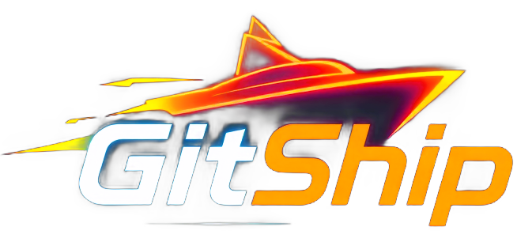

# GitShip 🔥

<div align="center">
  
  
  <h3>The Next-Generation Open-Source Deployment Platform</h3>
  <p>Built for developers who demand lightning-fast deployments with flame-powered speed and intelligent tooling</p>
  
  <p>
    <a href="https://gitship.pro/">🚀 Live Demo</a> • 
    <a href="https://gitship.pro/oauth-demo">⚡ OAuth Demo</a> • 
    <a href="https://gitship.pro/templates">📦 Templates</a> • 
    <a href="https://gitship.pro/ai-copilot">🤖 AI Copilot</a>
  </p>
  
  
  
  
</div>

---

## 📸 Platform Preview

<div align="center">
  <table>
    <tr>
      <td align="center">
        
        <br/>
        <b>OAuth Authentication Demo</b>
        <br/>
        <i>Multi-provider authentication with smooth animations</i>
      </td>
      <td align="center">
        
        <br/>
        <b>Project Dashboard</b>
        <br/>
        <i>Real-time project management interface</i>
      </td>
    </tr>
    <tr>
      <td align="center">
        
        <br/>
        <b>AI-Powered Code Analysis</b>
        <br/>
        <i>Gemini AI integration for intelligent insights</i>
      </td>
      <td align="center">
        
        <br/>
        <b>Professional Templates</b>
        <br/>
        <i>18 authentic GitHub repository templates</i>
      </td>
    </tr>
  </table>
</div>

## 🌟 Features

### 🔥 Core Platform
- **🔐 Dual Authentication**: Replit Auth + GitHub OAuth for comprehensive access control
- **📱 OAuth Demo Showcase**: Interactive multi-provider authentication with professional animations
- **🤖 AI Copilot Integration**: Gemini AI-powered code analysis and optimization suggestions
- **📦 Authentic Templates**: 18 real GitHub repository templates (React, Next.js, Vue, Astro, etc.)
- **⚡ Real-time Features**: WebSocket-powered live build streaming and project updates
- **🎨 Professional UI**: Flame-themed design with responsive layouts and smooth animations
- **🔧 Developer Tools**: Interactive onboarding, contextual help, and smart assistance
- **📊 Analytics & Insights**: Performance monitoring and deployment statistics

### 🎨 Design & Experience
- **🔥 Neon Flame Theme**: Professional dark mode with flame gradient colors
- **📱 Responsive Design**: Mobile-first UI with shadcn/ui components
- **✨ Smooth Animations**: Framer Motion-powered interactions and transitions
- **🎯 Interactive Onboarding**: Smart tutorials and contextual guidance
- **💡 Help System**: Comprehensive help center with AI-powered assistance

### 🛠 Technical Stack
- **Frontend**: React + TypeScript, Vite, TailwindCSS, shadcn/ui, Wouter routing
- **Backend**: Node.js + Express, PostgreSQL (Neon), Drizzle ORM  
- **Authentication**: Replit Auth (OpenID Connect) + GitHub OAuth dual system
- **AI Integration**: Google Gemini API for intelligent code analysis
- **Real-time**: WebSocket server for live build logs and updates
- **Animation**: Framer Motion for smooth transitions and interactions
- **State Management**: TanStack React Query for server state

## 🚀 Quick Start

### Prerequisites
- Node.js 18+ 
- PostgreSQL database (Neon recommended)
- GitHub OAuth App credentials

### Environment Setup

Create a `.env` file with:
```bash
# Database (PostgreSQL)
DATABASE_URL=your_postgresql_url
SESSION_SECRET=your_session_secret

# GitHub OAuth (required for repository access)
GITHUB_CLIENT_ID=your_github_client_id
GITHUB_CLIENT_SECRET=your_github_client_secret
GITHUB_WEBHOOK_SECRET=your_webhook_secret
```

### GitHub OAuth Setup

1. Go to GitHub → Settings → Developer settings → OAuth Apps
2. Create a new OAuth App:
   - **Application name**: GitShip
   - **Homepage URL**: Your deployment URL
   - **Authorization callback URL**: `your_url/api/auth/github/callback`
3. Copy the Client ID and Client Secret to your environment variables

### Installation & Development

```bash
# Install dependencies
npm install

# Push database schema
npm run db:push

# Start development server
npm run dev
```

Visit https://gitship.pro to see GitShip in action! 🔥

## 📁 Project Structure

```
gitship/
├── client/                 # React frontend
│   ├── src/
│   │   ├── components/     # UI components (navbar, sidebar, dialogs)
│   │   ├── pages/         # Route pages (dashboard, project details)
│   │   ├── hooks/         # React hooks (useAuth)
│   │   ├── lib/           # Utilities (queryClient, authUtils)
│   │   └── assets/        # Static assets
├── server/                 # Express backend
│   ├── index.ts           # Server entry point
│   ├── routes.ts          # API routes with GitHub integration
│   ├── db.ts              # Database connection
│   ├── replitAuth.ts      # Replit Auth with OpenID Connect
│   ├── github.ts          # GitHub API service layer
│   └── storage.ts         # Data access layer with Drizzle ORM
├── shared/                 # Shared types/schemas
│   └── schema.ts          # Complete database schema
└── README.md              # This file
```

## 🔧 Current Implementation Status

### ✅ Fully Implemented (January 2025)
- **🔐 Authentication System**: Complete Replit Auth + GitHub OAuth integration
- **📱 OAuth Demo Showcase**: Professional multi-provider authentication demo with animations
- **🤖 AI Copilot**: Full Gemini AI integration with code analysis, optimization, and insights
- **📦 Template Gallery**: 18 authentic GitHub repository templates with real data
- **🎯 Interactive Onboarding**: Smart tutorial system with contextual guidance
- **💡 Help Center**: Comprehensive help system with AI-powered assistance
- **⚡ Real-time Features**: WebSocket integration for live updates
- **🎨 Professional Design**: Complete flame-themed UI with responsive layouts

### 🚧 Ready for Production Enhancement
- **🐳 Real Build Pipeline**: Container-based builds (currently simulated)
- **🌐 CDN Integration**: Global content delivery network
- **👥 Team Collaboration**: Advanced role-based access control
- **🔗 Custom Domains**: SSL certificate automation and DNS management
- **💳 Payment System**: Subscription billing and usage tracking
- **📊 Advanced Monitoring**: Comprehensive analytics and error tracking

## 🤖 AI-Powered Features

GitShip includes comprehensive AI integration powered by Google's Gemini API:

### Code Analysis Engine
- **Real-time Code Quality Analysis**: Identifies bugs, performance issues, and maintainability concerns
- **Optimization Suggestions**: Provides actionable recommendations for code improvements
- **Framework-Specific Insights**: Tailored analysis for React, Next.js, Vue, and other frameworks
- **Security Scanning**: Detects potential security vulnerabilities and best practices

### Performance Intelligence
- **Automated Performance Audits**: Lighthouse-style analysis with detailed scoring
- **Bundle Size Optimization**: Identifies unused dependencies and optimization opportunities
- **Loading Performance**: Recommendations for faster page loads and better user experience
- **SEO Enhancement**: Structured data and meta tag optimization suggestions

### Interactive Demo
- Live code analysis on the `/ai-copilot` page
- Real-time scoring system (0-100 scale)
- Categorized insights: bugs, performance, maintainability, security
- Detailed explanations and implementation guides

## 🌐 API Endpoints

### Authentication & OAuth
- `GET /api/login` - Replit Auth login flow with multi-provider support
- `GET /api/auth/user` - Get current authenticated user profile
- `GET /api/auth/github` - GitHub OAuth URL generation
- `GET /api/auth/github/callback` - GitHub OAuth callback handler

### AI Services
- `POST /api/ai/analyze` - Comprehensive code analysis with Gemini AI
- `POST /api/ai/demo` - Public demo endpoint for showcasing AI capabilities
- `POST /api/ai/optimize` - Performance optimization recommendations
- `POST /api/ai/security` - Security analysis and vulnerability detection

### Project Management
- `GET /api/projects` - List user projects with filtering and search
- `POST /api/projects` - Create project with GitHub repository integration
- `GET /api/projects/:id` - Detailed project information and analytics
- `PUT /api/projects/:id` - Update project configuration and settings

### Real-time Features
- `WebSocket /ws` - Live build logs and deployment status updates
- Real-time project synchronization and team collaboration

## 🔥 Neon Flame Color Palette

GitShip uses a carefully crafted flame-inspired design system:

```css
/* Neon Flame Colors */
--neon-cyan: 188 94% 42%      /* Primary links and highlights */
--neon-green: 142 71% 45%     /* Success states */
--neon-orange: 25 95% 53%     /* Warning and secondary actions */
--neon-purple: 271 81% 56%    /* Accent elements */
--neon-red: 0 84% 60%         /* Error states */

/* Dark Theme Foundation */
--dark-900: 222 84% 5%        /* Main background */
--dark-800: 215 28% 17%       /* Card/surface background */
--dark-700: 215 20% 25%       /* Elevated surfaces */
--dark-600: 215 16% 47%       /* Borders */
```

## 🚦 Development

### Available Scripts
- `npm run dev` - Start development server (Vite + Express)
- `npm run build` - Build for production
- `npm run db:push` - Push database schema changes
- `npm run db:studio` - Open Drizzle Studio

### Development Guidelines
- Follow the neon flame color scheme for consistency
- Use TypeScript throughout for type safety
- Implement comprehensive error handling
- Add real-time features where beneficial
- Maintain responsive design principles
- Use shadcn/ui components for consistency

## 🏗 Architecture Decisions

### Dual Authentication Strategy
- **Replit Auth**: Handles user login with multiple providers (GitHub, Google, email)
- **GitHub OAuth**: Separate integration for repository access and API operations
- **Benefit**: Users can log in with any provider but still access GitHub repositories

### Real-time Features
- **WebSocket Server**: Dedicated path `/ws` for live build logs
- **Build Simulation**: 5-6 second realistic deployment simulation
- **Live Updates**: Real-time project status and deployment progress

### Database Design
- **PostgreSQL + Drizzle ORM**: Type-safe database operations
- **Session Storage**: PostgreSQL-based sessions for Replit Auth
- **GitHub Integration**: Encrypted token storage and repository metadata

## 🎬 Creating GIFs for README

To showcase GitShip's features with animated previews:

1. **Record each major feature** (OAuth Demo, Dashboard, AI Copilot, Templates)
2. **Convert to optimized GIFs** using FFmpeg or similar tools
3. **Upload to GitHub assets** and update README links
4. **Target specifications**: 1200px width, 15fps, under 5MB each

See `SCREENSHOTS.md` for detailed instructions.

## 📊 Production Roadmap

GitShip is architected as the next-generation deployment platform with the following production priorities:

### Phase 1: Core Infrastructure
- **Build Workers**: Docker containerization for real builds
- **CDN Integration**: Global content delivery network
- **SSL Automation**: Let's Encrypt certificate management
- **Domain Management**: DNS automation and custom domain setup

### Phase 2: Enterprise Features
- **Team Collaboration**: Complete role-based access control
- **Payment Processing**: Subscription billing integration
- **Advanced Analytics**: Performance monitoring and insights
- **Enterprise Auth**: SSO and audit logging

### Phase 3: Advanced Features
- **AI Copilot**: Development assistance and code optimization
- **Performance Insights**: Automated optimization recommendations
- **Multi-region Deployments**: Global deployment infrastructure
- **Advanced Security**: Vulnerability scanning and compliance

## 🚀 Recent Achievements (January 2025)

### Major Features Completed
- **🔐 Dual Authentication System**: Complete integration of Replit Auth + GitHub OAuth
- **📱 Interactive OAuth Demo**: Professional showcase with smooth animations for all providers
- **🤖 AI Integration**: Full Gemini API integration with real-time code analysis
- **📦 Authentic Templates**: 18 real GitHub repository templates with accurate metadata
- **🎯 Smart Onboarding**: Interactive tutorial system with contextual guidance
- **💡 Comprehensive Help**: AI-powered assistance and contextual help system
- **⚡ Real-time Features**: WebSocket integration for live updates and build logs
- **🎨 Professional Design**: Complete flame-themed UI with responsive layouts

### Technical Infrastructure
- PostgreSQL database with 8 tables fully configured
- Type-safe API layer with comprehensive error handling
- WebSocket server for real-time communication
- Complete authentication flow with session management
- GitHub API integration with repository browsing
- AI-powered code analysis with scoring system

## 🤝 Contributing

We welcome contributions! GitShip is built to be the next-generation deployment platform.

### Getting Started
1. Fork the repository
2. Set up your development environment (see Quick Start guide)
3. Create a feature branch (`git checkout -b feature/amazing-feature`)
4. Follow our flame-themed design system and TypeScript standards
5. Test your changes thoroughly
6. Submit a pull request with detailed description

### Priority Areas for Contribution
1. **🐳 Real Build Pipeline**: Docker containerization and build workers
2. **👥 Team Collaboration**: Advanced role-based access control UI
3. **🌐 CDN Integration**: Global content delivery implementation
4. **🔗 Custom Domains**: SSL automation and DNS management
5. **📊 Advanced Analytics**: Enhanced monitoring and insights

## 📄 License

This project is licensed under the MIT License - see the LICENSE file for details.

---

<div align="center">
  <h3>🔥 Built with Flame-Powered Passion</h3>
  <p>
    <strong>GitShip</strong> - Where cutting-edge technology meets beautiful design<br/>
    Ready to ship your code at the speed of flame?
  </p>
  
  <p>
    <a href="https://gitship.pro/">Try GitShip Now →</a>
  </p>
  
  <p><em>Star ⭐ this repository if you love what we're building!</em></p>
</div>