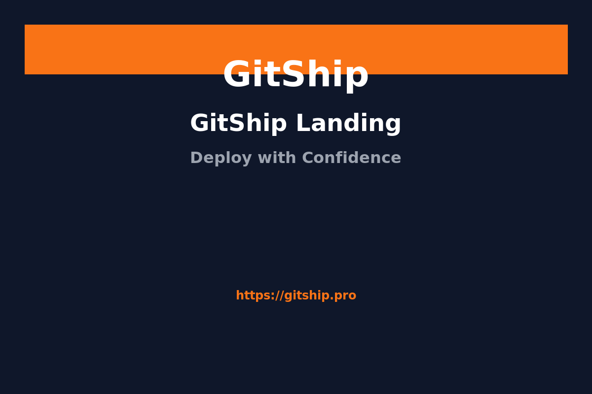

# GitShip Demo GIF - Complete Setup Summary

## ✅ What's Ready

1. **GitShip Application**: Running on port 5000 with all main pages functional
2. **Screenshot Scripts**: Multiple tools created for efficient capture
3. **GIF Creation Tools**: ImageMagick installed and ready
4. **Documentation**: Complete guides for manual and automated approaches

## 📋 Quick Action Steps

### Immediate Next Steps:
1. **Take screenshots** of these 6 pages (save as PNG):
   - `http://localhost:5000/` → `01-landing.png`
   - `http://localhost:5000/oauth-demo` → `02-oauth-demo.png` 
   - `http://localhost:5000/templates` → `03-templates.png`
   - `http://localhost:5000/ai-copilot` → `04-ai-copilot.png`
   - `http://localhost:5000/guides` → `05-guides.png`
   - `http://localhost:5000/analytics` → `06-analytics.png`

2. **Create GIF** using one of these methods:
   ```bash
   # Method 1: Using provided script
   ./create-gif.sh --make-gif
   
   # Method 2: Direct ImageMagick command
   convert -delay 250 -loop 0 -resize 1200x *.png gitship-demo.gif
   
   # Method 3: Online at ezgif.com/maker
   ```

## 🎯 What the GIF Will Show

Your GitShip demo will showcase:
- **Professional landing page** with flame-powered branding
- **Multi-provider OAuth system** (Replit, GitHub, Google, Twitter, Apple, Email)
- **Modern template gallery** (React, Next.js, Vue, Astro, etc.)
- **AI-powered development tools** and code analysis
- **Comprehensive documentation** and guides
- **Analytics dashboard** with performance monitoring

## 📁 Files Created

- `create-readme-gif.md` - Detailed manual instructions
- `capture-screenshots.js` - URL organization helper
- `create-gif.sh` - Shell script for GIF creation
- `auto-capture.mjs` - Automated capture script (requires system deps)
- `README-gif-guide.md` - Complete step-by-step guide
- `gif-creation-summary.md` - This summary file

## 🚀 For Your GitHub README

After creating `gitship-demo.gif`, add this to your README:

```markdown
## 🎬 GitShip in Action



Experience GitShip's comprehensive deployment platform with OAuth authentication, AI-powered tools, and modern templates.
```

## 🔧 Troubleshooting

- **Can't see pages**: Ensure GitShip is running on port 5000
- **401 errors**: Normal for unauthenticated requests, pages still load fine
- **Large GIF size**: Reduce quality with `-quality 75` in ImageMagick
- **Need help**: Check `README-gif-guide.md` for detailed instructions

Your GitShip application is ready and all tools are in place for creating a professional demo GIF!